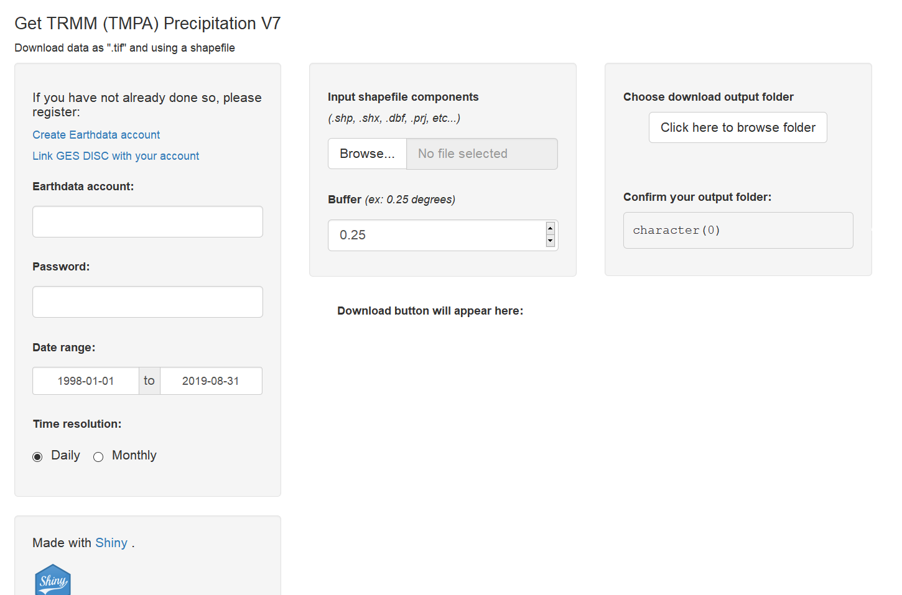
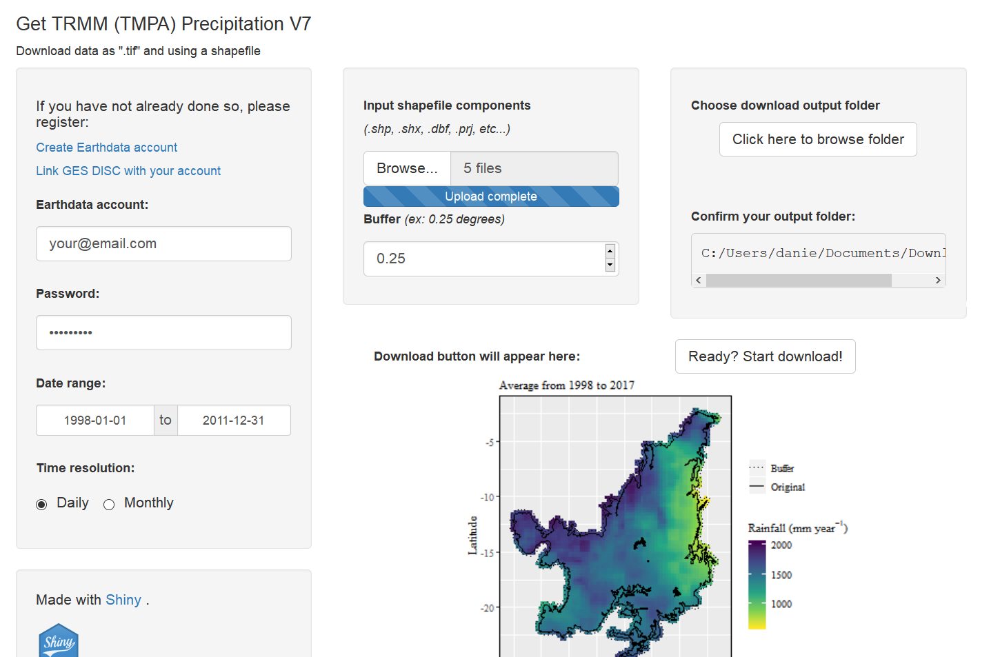

<div class="fluid-row" id="header">
    
    <h1 class="title toc-ignore">Satellite Precipitation Products Download</h1>
    <h4 class="author"><em>Daniel Althoff</em></h4>
</div>

# About

Satellite Precipitation Products Download (SPP-Down) is an App developed with <a href='https://shiny.rstudio.com/' target='blank'>Shiny</a> to download Precipitation Measuring Missions datasets from the <a href='https://disc.gsfc.nasa.gov/datasets/' target='blank'>Goddard Earth Sciences Data and Information Services Center</a> (GES DISC).<br> <br>
The main goal of the SPP-Down is to help people that are not proficient in programmming to download large datasets and/or manipulate specific file formats. Therefore, the SPP-Down performs some basic preprocessing before saving the final file.

* Data preprocessing consists of:
    * <em>.nc4</em> conversion to <em>.tif</em>;
    * transpose and flip ('y' direction) the <em>raster (.tif)</em> file to correct its orientation;
    * optionally adds a buffer to the <em>shapefile</em> (to cover more pixels along the border); and,
    * crop/mask <em>raster</em> files using the <em>shapefile</em>.
    
<b><em>Note:</em></b> If the desired time resolution is <b>Monthly</b>, the original unit is in <b>mm/hr</b> and will be converted to <b>mm/month</b> considering the correct number of days within each month.<br>
   
Be careful when comparing the sum of daily to monthly products. The following quote is from the <a href='https://climatedataguide.ucar.edu/climate-data/trmm-tropical-rainfall-measuring-mission?qt-climatedatasetmaintabs=1#qt-climatedatasetmaintabs' target='blank'>Expert Developer Guidance</a> (Dr. George J. Huffman - NASA) on the <b>Algorithm and Processing</b>:<br>
 <em>"Limits are imposed on the scaling to avoid unphysical results, so particularly in low-rain areas, <b>the 3B42 values in a month may not sum exactly to the corresponding 3B43</b>. For this reason, 3B43 is the preferred dataset for monthly values."</em> <br>
 -- 3B42 and 3B43 refers to daily and monthly products of the Tropical Rainfall Measuring Mission.

# Release history

* <b>1.0.0</b> (27-11-2019)
    * Available datasets: <a href='https://pmm.nasa.gov/data-access/downloads/trmm' target='blank'>Tropical Rainfall Measuring Mission</a> (<a href='https://disc.gsfc.nasa.gov/datasets/TRMM_3B42_Daily_7/summary' target='blank'>TRMM_3B42.v7</a> and <a href='https://disc.gsfc.nasa.gov/datasets/TRMM_3B43_7/summary' target='blank'>TRMM_3B43.v7</a>) 
    * Visualization of shapefile and buffer used to crop/mask

# How to use

<a href='https://urs.earthdata.nasa.gov/home' target='blank'>Create Earthdata account</a><br>
<a href='https://disc.gsfc.nasa.gov/earthdata-login' target='blank'>Link GES DISC with your account</a>

<!--<h4>1. Open the <b>SPP-Down</b> app</h4>
<h6>With ShinyApp</h6>
<p>Access the <a href="https://daniel-althoff.shinyapps.io/SPP-Down/" target="blank">SPP-Down</a> app directly in shinyapps.io.</p>-->

<h5>With R </h5>
<p>Install the required packages and run the <b>SPP-Down</b> app</p>

```{r setup}
if(!require(pacman)) install.packages('pacman')
pacman::p_load(dplyr, raster, rgdal, ncdf4, shiny, rasterVis, viridis, latticeExtra,
               sp, lubridate, rgeos, shinyjs, shinyFiles, update = F)

runGitHub("SPP-Down", "daniel-althoff")
```



* <b>Fill all required information</b> 
    * Provide your Earthdata account and password
    * Choose desired data range
    * Choose desired time resolution (Daily or Monthly)
    * Select your shapefile (remeber to select all components, i.e, <em>.shp, shx, .dbf, .prj, etc...</em>)
    * Input buffer (>= 0)
    * Select output folder
    * Check if output folder is correct
    
<p> After the shapefile upload completes, the main panel will render a plot showing the your original shapefile, the buffer, and the average annual precipitation (mm/year) from 1998 to 2017 (20 years). <br>
 For this tutorial, we used the Cerrado biome (Brazil) shapefile as an example. </p> 
<p>The <b>download button</b> appears once all required information are filled.
  

     
<p><b>Ready? Start download!</b> and check your output directory for a new folder (<em>"SPP_folder"</em>) and if data is being downloaded inside it.</p>
<p> Files will be saved as SPP_YYYYMMDD.tif (Daily) or SPP_YYYYMM.tif (Monthly), e.g., TRMM data referring to 01-june-1998: TRMM_19980601.tif (Daily) or TRMM_199806.tif (Monthly).</p>

<h3>Enjoy!</h3>
:smile:

# Acknowledgements

Special thanks to the <b>Goddard Space Flight Center</b>, <b>Goddard Earth Sciences Data and Information Services Center</b> and <b>NASA's Earth Science Data Systems</b> program.

# Data citation and references

* Althoff, D. (2019), Satellite Precipitation Products Download, GitHub repository, https://github.com/daniel-althoff/SPP-Down
* Huffman, G.J. (1997), Estimates of Root-Mean-Square Random Error for Finite Samples of Estimated Precipitation, J. Appl. Meteor, [https://doi.org/10.1175/1520-0450(1997)036<1191:EORMSR>2.0.CO;2](https://doi.org/10.1175/1520-0450(1997)036<1191:EORMSR>2.0.CO;2)
* Huffman, G.J., R.F. Adler, D.T. Bolvin, G. Gu, E.J. Nelkin, K.P. Bowman, Y. Hong, E.F. Stocker, D.B. Wolff (2007), The TRMM Multi-satellite Precipitation Analysis: Quasi- Global, Multi-Year, Combined-Sensor Precipitation Estimates at Fine Scale., J. Hydrometeor, https://doi.org/10.1175/JHM560.1
* Huffman, G.J., R.F. Adler, D.T. Bolvin, E.J. Nelkin (2010), The TRMM Multi-satellite Precipitation Analysis (TMPA). Chapter 1 in Satellite Rainfall Applications for Surface Hydrology, https://doi.org/10.1007/978-90-481-2915-7
* Tropical Rainfall Measuring Mission (TRMM) (2011), TRMM (TMPA/3B43) Precipitation Estimate L3 1 month 0.25 degree x 0.25 degree V7, Greenbelt, MD, Goddard Earth Sciences Data and Information Services Center (GES DISC), Accessed: [Data Access Date], https://doi.org/10.5067/TRMM/TMPA/MONTH/7
* Tropical Rainfall Measuring Mission (TRMM) (2016), TRMM (TMPA/3B42) Precipitation Estimate L3 1 day 0.25 degree x 0.25 degree V7, Edited by Andrey Savtchenko, Goddard Earth Sciences Data and Information Services Center (GES DISC), Accessed: [Data Access Date], https://doi.org/10.5067/TRMM/TMPA/DAY/7

